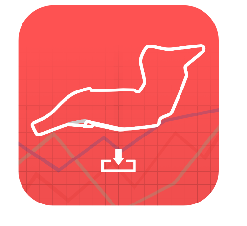

# Under Construction

  

This README.md is under construction. Please check back later for updated information.

------

# F1 Data Analysis

  

  

  

## Table of Contents
- [Under Construction](#under-construction)
- [F1 Data Analysis](#f1-data-analysis)
  - [Table of Contents](#table-of-contents)
  - [Documentation](#documentation)
  - [How to Use](#how-to-use)

## Documentation

This is an application that utilizes the [FastF1](https://github.com/theOehrly/Fast-F1) package to easily pull data for specified events, drivers, and sessions.

## How to Use

To use this application, you need to have [Python3](https://www.python.org/downloads/) installed on your machine.

*Note:* If you use MacOS, [Homebrew](https://docs.brew.sh/Installation) is strongly recommended.

